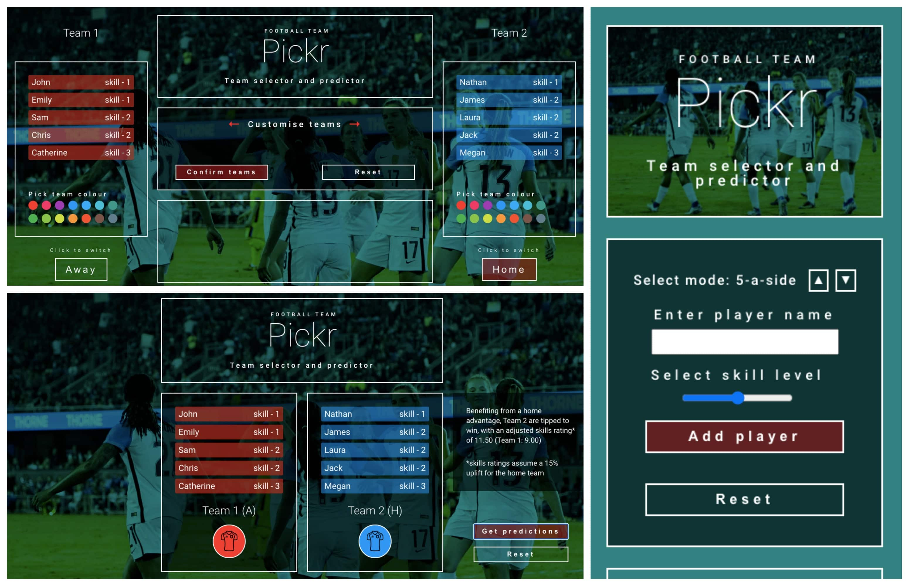

# Pickr

A React/Redux football team picking app that allows users to add players, generate and customise teams, and get predictions on the favourite team.

See below for setup and app notes.

See also `supporting-comments.md` for commentary on key development decisions.

## Setup

### Requirements

Check you have npm installed by running `npm -v`.

### Installation

Clone git repository and run npm install in the project folder:

`git clone git@github.com:harrietgoddard/pickr.git`

`npm install`

Once the packages have installed, run the app in development mode:

`npm start`

Open [http://localhost:3000](http://localhost:3000) to view it in the browser.

The page will reload if you make edits.

## App notes

### Summary of user experience

On initial page load, the user is presented with a form, in which they can specifiy the number of players per team (default five), and add players in turn. The user inputs a player name (required) and selects a player skill level between one and three (default two), before adding to the list of players displayed below. If the number of players per team is subsequently lowered, where necessary, the user will be prompted to delete players.

Once the required number of players have been added, the user can select whether teams should be balanced by skill level (default random) and click to generate teams. Once generated, the user can select team colours and choose the home team.

Once confirmed, the final teams are displayed along with the option to get predictions on the favourite team (based on skill level and the home advantage), and an option to reset the app.

### Built in settings and adaptability

A number of default/built in settings are included that can be changed by a developer to modify the app, and should facilitate any potential addition of functionality to allow the user to modify these settings themselves (eg. specify team names).

All built in settings are set in the following file:

`src/data/settings.js`

Default settings:
- default number of players: 5
- minimum number of players: 2,
- maximum number of players: 20,
- home advantage: increase total skills value by 15%
- team names: "Team 1" and "Team 2"

Note that while the UI is designed with two teams in mind, the team allocation functions (in `src/data/teamPicker.js`) can be used for any number of teams (in case of adapting the app for league functionality for example).

### Basis of logic

Random team allocation uses the Fisher-Yates shuffle algorithm to shuffle an array of players. 

To balance teams by skill, the array of players is ordered by skill level, and each player in the array is allocated alternately to each team. Note that this can lead to Team 2 having an advantage in terms of total skill level.

To calculate the favourite team, each team's skill levels are totalled, and an uplift is subsequently applied to the home team. The team with the highest score is the favourite.

### Other

Tests are included for the team allocation and predictions logic, in `src/data/reducer/teamPicker.test.js` and `src/data/reducer/predictor.test.js` respectively. To run tests, run the following commands:

`npm test src/data/reducer/teamPicker.test.js`

`npm test src/data/reducer/predictor.test.js`

The user experience is optimised in browsers that support css grid (display flex is included as fallback).